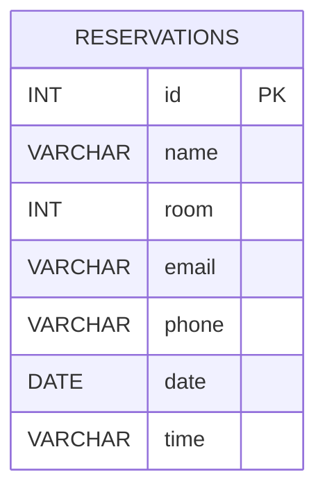

# Hotel Reservation System — Java & JDBC

A console-based hotel reservation system built with **Java, JDBC, and MySQL**. The project demonstrates how to build a database-driven Java application with CRUD operations, object-oriented design, JDBC database connectivity, exception handling, and separation of application responsibilities.

This project was built as a hands-on Java application to practice connecting a Java program to a relational database and organizing database operations into separate layers.

## Features

* Create hotel reservations
* View existing reservations
* Update reservation information
* Delete reservations
* Store reservation data in MySQL
* Connect Java to MySQL using JDBC
* Use `PreparedStatement` for parameterized SQL queries
* Handle user input and invalid numeric values
* Generate reservation date and time automatically
* Separate database operations from application logic
* Use a Java model class to represent reservation data
* Console-based menu-driven interface

## Technologies Used

| Technology    | Purpose                             |
| ------------- | ----------------------------------- |
| Java          | Application development             |
| JDBC          | Java-to-MySQL database connectivity |
| MySQL         | Relational database                 |
| SQL           | Database operations                 |
| IntelliJ IDEA | Development environment             |

## Project Architecture

The application separates responsibilities into different packages:

```text
src/
├── app/
│   └── Main.java
│
├── model/
│   └── Reservation.java
│
├── services/
│   └── HotelReservationService.java
│
├── dao/
│   └── HotelReservationDB.java
│
├── connection/
│   └── DBConnection.java
│
└── util/
    └── DateAndTime.java
```

### Application Flow

```text
User
 │
 ▼
Main
 │
 ▼
HotelReservationService
 │
 ├──────────────► Reservation Model
 │
 ▼
HotelReservationDB
 │
 ▼
DBConnection
 │
 ▼
JDBC
 │
 ▼
MySQL
```

### Package Responsibilities

**`app`**

Contains the application entry point and console menu.

**`model`**

Contains Java classes that represent application data. The `Reservation` class stores reservation information such as the client name, phone number, email, room number, date, and time.

**`services`**

Contains the application/service logic. `HotelReservationService` handles user interaction and coordinates reservation operations.

**`dao`**

Contains database operations. `HotelReservationDB` is responsible for executing SQL queries against the reservations table.

**`connection`**

Contains the JDBC connection logic used to connect the application to MySQL.

**`util`**

Contains reusable utility functionality such as generating the current date and time.

## Database Design

The current version uses a single `reservations` table.



### Reservation Table

| Column  | Description                   |
| ------- | ----------------------------- |
| `id`    | Unique reservation identifier |
| `name`  | Client name                   |
| `room`  | Reserved room number          |
| `email` | Client email address          |
| `phone` | Client phone number           |
| `date`  | Reservation date              |
| `time`  | Reservation time              |

Because the current application uses a single table, there are no foreign-key relationships in this version.

## Database Setup

Create the database:

```sql
CREATE DATABASE hotel_db;

USE hotel_db;
```

Create the reservations table:

```sql
CREATE TABLE reservations (
    id INT PRIMARY KEY AUTO_INCREMENT,
    name VARCHAR(100) NOT NULL,
    room INT NOT NULL,
    email VARCHAR(150) NOT NULL,
    phone VARCHAR(30) NOT NULL,
    date DATE NOT NULL,
    time VARCHAR(10) NOT NULL
);
```

The exact database configuration should be provided through your local development environment rather than committing credentials to the repository.

## JDBC Connection

The application uses JDBC to connect Java with MySQL.

The database connection is isolated inside:

```text
connection/DBConnection.java
```

This allows the rest of the application to request a database connection without needing to duplicate the JDBC connection configuration throughout the project.

The general JDBC flow is:

```text
Java Application
       │
       ▼
DriverManager
       │
       ▼
JDBC Driver
       │
       ▼
MySQL Database
```

## CRUD Operations

The system demonstrates the four fundamental database operations.

### Create

A new reservation is inserted into the database using a parameterized `INSERT` statement.

```sql
INSERT INTO reservations
(name, room, email, phone, date, time)
VALUES (?, ?, ?, ?, ?, ?);
```

### Read

Existing reservations are retrieved with:

```sql
SELECT * FROM reservations;
```

The returned records are processed through a JDBC `ResultSet`.

### Update

Reservation information can be updated using parameterized `UPDATE` statements.

For example:

```sql
UPDATE reservations
SET name = ?
WHERE phone = ?;
```

The application also supports updating the room number.

### Delete

Reservations can be removed from the database using:

```sql
DELETE FROM reservations
WHERE name = ? AND phone = ?;
```

## PreparedStatement

The project uses JDBC `PreparedStatement` rather than constructing SQL queries by directly concatenating user input.

For example:

```java
String query =
        "INSERT INTO reservations(name, room, email, phone, date, time) " +
        "VALUES (?, ?, ?, ?, ?, ?)";

PreparedStatement statement =
        connection.prepareStatement(query);
```

The values are then supplied separately:

```java
statement.setString(1, reservation.getClientName());
statement.setInt(2, reservation.getRoomNo());
statement.setString(3, reservation.getClientEmail());
statement.setString(4, reservation.getClientPhone());
statement.setString(5, reservation.getReservationDate());
statement.setString(6, reservation.getReservationTime());
```

This keeps the SQL statement separate from the values being supplied by the application.

## Date and Time

Reservation date and time are generated automatically using Java's date/time API.

The project uses:

```java
LocalDate
LocalTime
DateTimeFormatter
```

This functionality is separated into:

```text
util/DateAndTime.java
```

Keeping this functionality in a utility class prevents date/time generation logic from being duplicated across the application.

## Exception Handling

The application handles common input-related errors, including invalid numeric input.

For example, the console menu converts user input into an integer:

```java
int choice = Integer.parseInt(scanner.nextLine());
```

Invalid input is handled using exception handling so that the application can display an appropriate message instead of terminating immediately.

Database operations also handle SQL-related exceptions.

## Running the Project

### Prerequisites

Make sure the following are installed:

* Java JDK
* MySQL Server
* MySQL JDBC Driver
* IntelliJ IDEA or another Java IDE

### 1. Clone the repository

```bash
git clone https://github.com/Hamadullah-Odho/HotelReservationSystem-JDBC.git
```

### 2. Create the database

Open MySQL and execute:

```sql
CREATE DATABASE hotel_db;

USE hotel_db;

CREATE TABLE reservations (
    id INT PRIMARY KEY AUTO_INCREMENT,
    name VARCHAR(100) NOT NULL,
    room INT NOT NULL,
    email VARCHAR(150) NOT NULL,
    phone VARCHAR(30) NOT NULL,
    date DATE NOT NULL,
    time VARCHAR(10) NOT NULL
);
```

### 3. Configure the database connection

Open:

```text
src/connection/DBConnection.java
```

Configure the local MySQL connection using your own:
